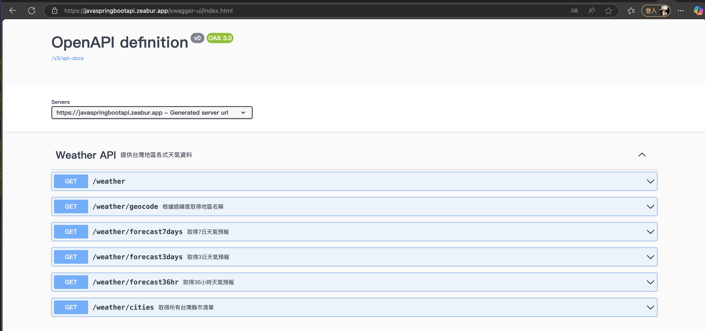

# Weather API

## 專案簡介

此專案為 **台灣地區天氣查詢 API**，基於 Spring Boot 開發，並提供 RESTful API 以獲取 36 小時、3 日、7 日天氣預報及地理位置反查功能。
內建 Swagger UI 以便測試 API。
此專案有部署到Zeabur平台使用，並連接到Android App串接使用

下面是Github上的時雨APP連結
[時雨APP連結](https://github.com/AlexanderChen5966/WeatherAPP)

---

## **快速開始**
### **環境需求**
- JDK 17 或以上版本
- Maven 3.6+
- Spring Boot 3+

### **啟動專案**

```bash
# 創建.env環境變數檔案，設定中央氣象局公開資料API Key和Google API Key
CWA_API_KEY=自己的API Key
GOOGLE_API_KEY=自己的API Key
```

```bash
# 編譯並啟動專案
mvn spring-boot:run
```
啟動後預設端口為 **http://localhost:8080**。

### **Swagger 文件**
啟動後可於 [http://localhost:8080/swagger-ui.html](http://localhost:8080/swagger-ui.html) 查看 API 文件。

---

## **API 規格**

### 1. 取得 36 小時天氣預報
- **URL:** `GET /weather/forecast36hr`
- **參數:** `locationName` (String) - 城市名稱
- **回傳範例:**
```json
{
  "location": "台北市",
  "forecast": [ ... ]
}
```

### 2. 取得 3 日天氣預報
- **URL:** `GET /weather/forecast3days`
- **參數:** `locationName` (String)
- **回傳:** `WeatherResponse`

### 3. 取得 7 日天氣預報
- **URL:** `GET /weather/forecast7days`
- **參數:** `locationName` (String)
- **回傳:** `WeatherResponse`

### 4. 根據經緯度取得地區名稱
- **URL:** `GET /weather/geocode`
- **參數:** `lat` (double), `lng` (double)
- **回傳:** `String`


### 5. 取得台灣縣市清單
- **URL:** `GET /weather/cities`
- **回傳:** `List<String>`

---

## **專案結構**
```
src/main/java/com/aleanderchen/weatherapi
├── controller
│   └── WeatherController.java   # API 控制器
├── service
│   ├── WeatherService.java      # 天氣服務邏輯
│   ├── CwaApiService.java       # 中央氣象局 API 串接
│   └── GoogleMapService.java    # Google 地圖 API
├── dto
│   ├── WeatherResponse.java     # DTO (天氣資料)
│   └── WeatherAllResponse.java  # DTO (整合資料)
└── util
    └── HttpClientUtil.java      # HTTP 工具類
```

---

## **依賴**
- Spring Boot Starter Web
- Spring Boot Actuator
- Springdoc OpenAPI UI
- org.json
- Spring Boot DevTools
- Spring Boot Starter Test


---
## 專案Swagger UI文件圖示


---
## **授權**
MIT License
